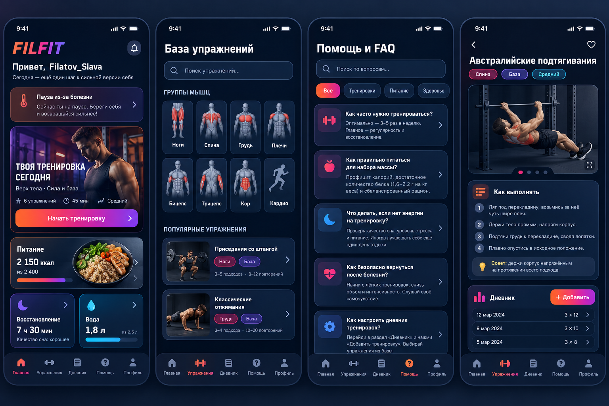

# Единая визуальная система Fitness Mini App

Дата: 2026-09-24
Статус: согласование перед планированием реализации

## 1. Цель

Привести всё приложение к единому выразительному визуальному языку, показанному
на утверждённом макете, без изменения существующих пользовательских сценариев,
API и структуры данных.

Новая система должна решить три проблемы текущего интерфейса:

1. яркие новые блоки и старые плоские экраны выглядят как разные приложения;
2. многочисленные самостоятельные контейнеры создают лишний объём и не
   объединяют связанную информацию;
3. группы мышц обозначены буквами вместо понятных пиктограмм.

Утверждённый визуальный референс:



Референс задаёт визуальный язык, а не новую информационную архитектуру.
Существующие разделы и названия навигации сохраняются.

## 2. Основные принципы

- Один экран собирается из небольшого набора общих компонентов, а не из
  уникальных CSS-исключений для каждой страницы.
- Каждый самостоятельный модуль имеет насыщенную тонированную подложку,
  различимую границу и умеренную глубину.
- Связанные строки объединяются в один модуль с внутренними разделителями.
  Нельзя превращать каждую строку в отдельную большую карточку.
- Основной градиент используется для действий, активного состояния и ключевых
  акцентов. Он не заливает весь экран и не конкурирует с содержанием.
- Зелёный перестаёт быть фирменным цветом и остаётся только семантическим
  цветом успешного состояния.
- Тёмная и светлая темы используют одинаковую иерархию, размеры, радиусы и
  компоненты. Отличаются только значения цветовых токенов и теней.
- Telegram Mini App, браузер и PWA получают один интерфейс с корректными
  safe-area, системным выходом и существующей навигацией назад.

## 3. Палитра и токены

### 3.1. Фирменный акцент

Главный акцент — градиент:

```css
linear-gradient(120deg, #ff6b24 0%, #e83d81 52%, #7c4dff 100%)
```

Опорные цвета:

| Назначение | Значение |
|---|---|
| Оранжевый акцент | `#ff6b24` |
| Малиновый переход | `#e83d81` |
| Фиолетовый акцент | `#7c4dff` |
| Информационный голубой | `#21c8e5` |
| Успех | `#35c98b` |
| Предупреждение | `#f2b84b` |
| Ошибка | `#ff5f72` |

Градиент применяется к основным кнопкам, активным иконкам, индикаторам
прогресса, небольшим декоративным границам и ключевым цифрам. Голубой
используется для информации, ссылок и нейтральных данных. Статусные цвета не
заменяют фирменный акцент.

### 3.2. Тёмная тема

| Токен | Значение/назначение |
|---|---|
| `--app-bg` | `#07111f`, основной фон |
| `--app-bg-deep` | `#040a14`, глубокий фон |
| `--surface-base` | `#101b2f`, обычный модуль |
| `--surface-raised` | `#18253f`, приподнятый модуль |
| `--surface-inset` | `#0a1628`, поле или внутренняя область |
| `--text-primary` | `#f6f8ff` |
| `--text-secondary` | `#9eacc4` |

Карточки могут получать один из ограниченного набора тонов: indigo, plum,
ember, ocean и neutral. Тон задаётся вариантом общего компонента, а не
произвольным цветом внутри страницы.

### 3.3. Светлая тема

Светлая тема использует тёплый холодно-белый фон `#f7f4f8`, тёмный текст и
слабые персиковые, сиреневые и голубые тонированные поверхности. Белая карточка
на белом фоне без границы и оттенка не допускается.

Контраст обычного текста должен быть не ниже 4.5:1, крупного текста и значимых
иконок — не ниже 3:1.

## 4. Базовые компоненты

Новый слой компонентов размещается в `frontend/src/components/ui`. Он не
хранит бизнес-состояние и не выполняет API-запросы.

### 4.1. `AppCard`

Общая поверхность с вариантами:

- `neutral` — обычный контент;
- `indigo`, `plum`, `ember`, `ocean` — тематические модули;
- `interactive` — кликабельная карточка;
- `hero` — крупный медиаблок;
- `inset` — внутренняя сгруппированная область;
- `success`, `warning`, `danger` — только статусные сообщения.

Карточка задаёт фон, границу, радиус и тень. Вложенная карточка разрешена только
для настоящей внутренней области: формы, списка подходов, графика или
подтверждения. Простые строки внутри одного смыслового блока разделяются линией
или отступом.

### 4.2. Действия

- `PrimaryButton` — фирменный градиент, одно главное действие в видимой области;
- `SecondaryButton` — насыщенная тонированная поверхность;
- `GhostButton` — действие без дополнительного контейнера;
- `DangerButton` — только необратимые или опасные операции;
- `IconButton` — квадратная область не меньше 44×44 px.

Disabled-состояние сохраняет читаемый текст, но убирает свечение и снижает
контраст поверхности. Нажатие даёт короткое масштабирование, а при
`prefers-reduced-motion` анимация отключается.

### 4.3. Формы и навигационные элементы

Общие компоненты: `AppField`, `AppSelect`, `AppTextarea`, `AppChip`,
`SegmentedControl`, `StatusNotice`, `AppModal`, `PageHeader`, `EmptyState` и
`SkeletonCard`.

Все поля имеют 16 px шрифт на мобильном экране, отчётливый label, единый focus
ring и минимальную высоту 44 px. Ошибка показывается текстом и цветом, а не
только красной границей.

## 5. Нижняя навигация

Навигация из утверждённого макета заменяет текущую объёмную конструкцию.

- Сохраняются текущие пять разделов: «Главная», «Тренировки», «Питание»,
  «Прогресс», «Ещё».
- Панель визуально продолжает экран и занимает минимально необходимую высоту.
- На мобильном экране верхние углы панели имеют умеренный радиус 18–22 px;
  форма большой отдельной капсулы не используется.
- Вокруг активного пункта нет второй сплошной плашки.
- Активность обозначается градиентной иконкой и подписью, а также короткой
  тонкой линией снизу.
- Неактивные элементы используют спокойный серо-голубой цвет.
- Safe-area iPhone включается во внутренний нижний отступ, не увеличивая
  визуальную высоту основного ряда.
- Desktop-навигация остаётся верхней, но наследует те же активные состояния и
  токены.

Целевая высота видимого ряда мобильной навигации — 58–64 px без системной
safe-area. Каждый пункт сохраняет область нажатия не менее 44×44 px.

## 6. Пиктограммы групп мышц

`MuscleGroupIcon` становится единым code-native SVG-компонентом. Он принимает
нормализованное имя группы и состояние `active`/`inactive`.

Обязательные пиктограммы:

- ноги — фронтальный силуэт с выделенными квадрицепсами;
- спина — задний силуэт с выделенной широчайшей областью;
- грудь — фронтальный торс с выделенными грудными мышцами;
- плечи — торс с выделенными дельтами;
- бицепс — согнутая рука или торс с выделенным бицепсом;
- трицепс — рука/задний торс с выделенным трицепсом;
- кор — торс с выделенной центральной областью;
- кардио — бегущий человек или кардиолиния с силуэтом.

Компонент понимает русские и английские варианты данных (`ноги`/`legs`,
`грудь`/`chest`, `кор`/`core`). Неизвестная группа получает нейтральный силуэт,
но никогда не отображается первой буквой.

SVG создаются внутри проекта, имеют `aria-hidden` в кнопках с текстовой
подписью и не требуют растровых файлов или внешнего CDN.

## 7. Правила компоновки экранов

### 7.1. Иерархия

Каждый пользовательский экран строится в порядке:

1. компактный заголовок и контекст;
2. один главный модуль или ключевой показатель;
3. связанные рабочие модули;
4. второстепенные ссылки и справка.

На одном уровне нельзя смешивать плоские блоки без рамок, массивные карточки и
hero-модули с несовместимыми радиусами.

### 7.2. Плотность

- Базовый промежуток между модулями: 12 px на мобильном, 16 px на desktop.
- Внутренний отступ обычной карточки: 14–16 px.
- Крупный hero допускает 20–24 px.
- Типовой радиус: 18 px; hero и крупная модалка: 22–24 px; поле: 14 px.
- Горизонтальный отступ страницы: 16 px на мобильном.
- Списки истории, FAQ, подходов и параметров группируются внутри одного
  контейнера, когда принадлежат одному разделу.

### 7.3. Медиа

Фотографии и иллюстрации используются только там, где они помогают распознать
действие или раздел: главная, каталог, программа, упражнение и база знаний.
Формы, настройки, админка и системные состояния используют цветные поверхности
и пиктограммы без декоративной фотографии.

## 8. Область применения

Система применяется ко всем маршрутам из `frontend/src/App.tsx`:

- главная и онбординг;
- тренировки, каталог, программы и активная тренировка;
- питание;
- прогресс, графики, замеры и explorer упражнений;
- профиль, уведомления и экран «Ещё»;
- AI-чат, поддержка, приглашения и социальные функции;
- справка и база знаний;
- все пользовательские модалки и offline/update-состояния;
- административные экраны.

Админка сохраняет повышенную плотность и не получает декоративные hero-фото,
но использует те же поля, карточки, кнопки, статусы, таблицы и модалки.

## 9. Стратегия миграции

Выбран компонентный переход, а не глобальное перекрашивание старых классов.

1. Ввести токены, примитивы, навигацию и пиктограммы.
2. Перевести оболочку, авторизацию, глобальные уведомления и общие состояния.
3. Перевести главную и ежедневные модули.
4. Перевести тренировки, каталог, программы и активную сессию.
5. Перевести питание, прогресс и замеры.
6. Перевести профиль, FAQ, поддержку, AI и социальные разделы.
7. Перевести админку и удалить оставшиеся визуальные исключения.
8. Выполнить общую проверку тёмной/светлой темы и production deployment.

Каждый этап должен быть законченным, проверенным и закоммиченным отдельно.
Следующий этап не начинается при красных обязательных тестах предыдущего.

## 10. Совместимость и ограничения

- Backend, API-контракты, маршруты и пользовательские данные не меняются.
- Не добавляется внешний UI-kit, CDN или runtime-зависимость от сети.
- Telegram MainButton/BackButton, системный выход Android и iOS edge-swipe
  сохраняются.
- Модальные окна сохраняют `role="dialog"`, `aria-modal`, focus trap/restore,
  Escape и Telegram BackButton.
- Интерфейс обязан работать на ширинах 320, 375/393 и 1440 px, а также на
  экранах малой высоты.
- Hero-карточки и градиенты не должны ухудшать offline-режим: обязательный
  контент остаётся доступен без загрузки внешних изображений.
- Опасные действия остаются визуально красными и не маскируются фирменным
  градиентом.

## 11. Проверка и критерии приёмки

Для каждого этапа обязательны релевантные unit и Playwright-тесты. Для всей
миграции обязательны:

- полный frontend unit suite;
- Chromium Playwright suite;
- WebKit/iPhone smoke;
- accessibility suite без серьёзных нарушений axe;
- visual snapshots ключевых экранов;
- ручная или автоматизированная проверка 320, 375/393 и 1440 px;
- тёмная и светлая темы;
- offline/reconnect и stale-release сценарии;
- lint, production build и bundle budget.

Работа считается завершённой, когда:

1. все маршруты используют новую палитру и общие поверхности;
2. старый зелёный фирменный акцент отсутствует, кроме success-состояний;
3. обычные связанные строки не раздроблены на объёмные самостоятельные
   контейнеры;
4. нижняя навигация соответствует компактному виду утверждённого макета;
5. группы мышц нигде не представлены буквенными аватарами;
6. контраст, touch targets, safe-area и модальная доступность проходят проверки;
7. visual snapshots обновлены осознанно и просмотрены;
8. каждый законченный этап имеет отдельный commit;
9. после полной проверки изменения отправлены в production-ветку и развёрнуты
   по действующему VPS-runbook с backup и health-check.

## 12. Вне области задачи

- изменение функций приложения и пользовательских сценариев;
- новая структура нижней навигации;
- замена exercise media или каталога упражнений;
- изменение backend и базы данных;
- копирование интерфейса или товарных знаков стороннего фитнес-бренда.
