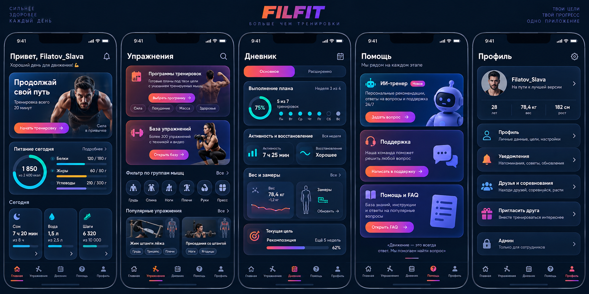
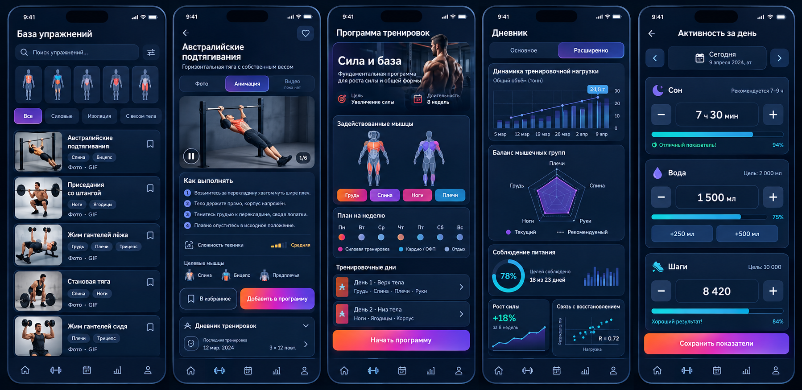

# Единая визуальная система Fitness Mini App

Дата: 2026-09-24
Статус: утверждённая архитектура и визуальное направление, обновлённая спецификация на проверке

## 1. Цель

Привести всё приложение к единому выразительному визуальному языку и новой
понятной структуре из пяти корневых разделов. Существующие пользовательские
данные, важные deep links и публичные API сохраняются; навигация и группировка
функций меняются по утверждённым макетам.

Новая система должна решить четыре проблемы текущего интерфейса:

1. яркие новые блоки и старые плоские экраны выглядят как разные приложения;
2. многочисленные самостоятельные контейнеры создают лишний объём и не
   объединяют связанную информацию;
3. группы мышц обозначены буквами вместо понятных пиктограмм.
4. функции распределены между «Питанием», «Прогрессом» и «Ещё» без ясной
   пользовательской модели, а режимы аналитики «Основное» и «Расширенно» почти
   не отличаются и требуют проверки расчётов.

Утверждённые визуальные референсы:





Референсы задают визуальный язык, информационную архитектуру, плотность модулей
и состав ключевых экранов. Тексты и реальные данные берутся из приложения, а
не копируются из иллюстративных значений макета.

## 2. Основные принципы

- Один экран собирается из небольшого набора общих компонентов, а не из
  уникальных CSS-исключений для каждой страницы.
- Каждый самостоятельный модуль имеет насыщенную тонированную подложку,
  различимую границу и умеренную глубину.
- Связанные строки объединяются в один модуль с внутренними разделителями.
  Нельзя превращать каждую строку в отдельную большую карточку.
- Основной градиент используется для действий, активного состояния и ключевых
  акцентов. Он не заливает весь экран и не конкурирует с содержанием.
- Зелёный перестаёт быть фирменным цветом и остаётся только семантическим
  цветом успешного состояния.
- Тёмная и светлая темы используют одинаковую иерархию, размеры, радиусы и
  компоненты. Отличаются только значения цветовых токенов и теней.
- Telegram Mini App, браузер и PWA получают один интерфейс с корректными
  safe-area, системным выходом и существующей навигацией назад.

## 3. Палитра и токены

### 3.1. Фирменный акцент

Главный акцент — градиент:

```css
linear-gradient(120deg, #ff6b24 0%, #e83d81 52%, #7c4dff 100%)
```

Опорные цвета:

| Назначение | Значение |
|---|---|
| Оранжевый акцент | `#ff6b24` |
| Малиновый переход | `#e83d81` |
| Фиолетовый акцент | `#7c4dff` |
| Информационный голубой | `#21c8e5` |
| Успех | `#35c98b` |
| Предупреждение | `#f2b84b` |
| Ошибка | `#ff5f72` |

Градиент применяется к основным кнопкам, активным иконкам, индикаторам
прогресса, небольшим декоративным границам и ключевым цифрам. Голубой
используется для информации, ссылок и нейтральных данных. Статусные цвета не
заменяют фирменный акцент.

### 3.2. Тёмная тема

| Токен | Значение/назначение |
|---|---|
| `--app-bg` | `#07111f`, основной фон |
| `--app-bg-deep` | `#040a14`, глубокий фон |
| `--surface-base` | `#101b2f`, обычный модуль |
| `--surface-raised` | `#18253f`, приподнятый модуль |
| `--surface-inset` | `#0a1628`, поле или внутренняя область |
| `--text-primary` | `#f6f8ff` |
| `--text-secondary` | `#9eacc4` |

Карточки могут получать один из ограниченного набора тонов: indigo, plum,
ember, ocean и neutral. Тон задаётся вариантом общего компонента, а не
произвольным цветом внутри страницы.

### 3.3. Светлая тема

Светлая тема использует тёплый холодно-белый фон `#f7f4f8`, тёмный текст и
слабые персиковые, сиреневые и голубые тонированные поверхности. Белая карточка
на белом фоне без границы и оттенка не допускается.

Контраст обычного текста должен быть не ниже 4.5:1, крупного текста и значимых
иконок — не ниже 3:1.

## 4. Информационная архитектура

### 4.1. Корневые разделы

| Раздел | Основное содержимое | Канонический route |
|---|---|---|
| Главная | ближайшая тренировка, питание, сон, вода и шаги | `/` |
| Упражнения | программы тренировок и база упражнений | `/train` |
| Дневник | история, прогресс, замеры и аналитика | `/progress` |
| Помощь | ИИ-тренер, поддержка и FAQ | `/help-center` |
| Профиль | аккаунт, уведомления, социальные функции и условная админка | `/profile` |

Существующие прямые адреса `/nutrition`, `/measurements`, `/programs`,
`/workouts`, `/ai`, `/support`, `/invite`, `/social` и административные routes
продолжают работать. `/more` перенаправляется на `/profile`. Публичные `/help`,
`/faq` и `/knowledge` сохраняются без обязательной авторизации; новый
`/help-center` служит авторизованным хабом приложения.

### 4.2. Главная

Главная сохраняет ближайшую тренировку, расписание и важные текущие состояния.
К ним добавляется компактный модуль питания с текущими калориями, БЖУ и
переходом в полный дневник питания.

Сон, вода и шаги показываются тремя отдельными согласованными карточками. Каждая
карточка содержит иконку, последнее значение, цель или прогресс и открывает
единый экран «Активность за день». Внутри этого экрана пользователь:

- переключает дату стрелками или календарём;
- вводит продолжительность сна;
- добавляет воду быстрыми действиями `+250 мл` и `+500 мл` либо точным вводом;
- вводит количество шагов;
- сохраняет показатели выбранного локального дня.

Карточки не дублируют полную форму на главной и не превращаются в три больших
самостоятельных блока.

### 4.3. Упражнения

Корневой экран содержит два основных модуля:

1. **Программы тренировок** — готовые планы, цель, длительность, уровень,
   оборудование, расписание и визуальное выделение тренируемых мышц;
2. **База упражнений** — поиск, анатомические фильтры групп мышц и карточки
   упражнений.

Название «Программы» в пользовательском интерфейсе заменяется на «Программы
тренировок», «Каталог упражнений» — на «База упражнений». Самостоятельный блок
«Недавние» удаляется. История пользователя остаётся доступна в дневнике, а
поиск и закрепления упражнений сохраняются в базе и explorer.

Каждая карточка упражнения получает уникальное превью конкретного движения.
Источники выбираются в таком порядке:

1. проверенный `thumbnail_url`;
2. локальная миниатюра, детерминированно созданная из первого кадра
   `animation_url`;
3. анатомическая пиктограмма целевой группы мышц как fallback.

Активное упражнение не может показывать букву или нерелевантную стоковую
фотографию. Media audit проверяет наличие уникального превью и корректность
соответствия упражнению.

Карточка упражнения открывает детальный экран с вкладками:

- **Фото** — статическое превью техники;
- **Анимация** — существующий локальный GIF/WebP;
- **Видео** — `video_url`, а при отсутствии неактивное состояние «Видео пока
  нет».

При появлении `video_url` видео запускается только действием пользователя,
показывает стандартные понятные controls и воспроизводит звук по выбору
пользователя. Автозапуск видео со звуком запрещён.

Под медиаблоком находятся сгруппированные инструкции, сложность техники,
целевые мышцы, избранное, добавление в тренировку и история выполнения.
Существующие поля `thumbnail_url`, `animation_url` и `video_url` используются
без нового внешнего медиапровайдера.

Карточка программы показывает не декоративную фотографию сама по себе, а
сочетает цель программы с фронтальным/задним силуэтом тела и выделенными
мышечными областями. Внутри программы видны длительность, недельный ритм,
оборудование, тренировочные дни и мышцы каждого дня.

### 4.4. Дневник

«Дневник» заменяет корневой раздел «Прогресс» и включает историю тренировок,
прогресс, восстановление и замеры. Route `/progress` сохраняется ради совместимости.

Режимы получают разный состав:

- **Основное** — выполнение плана, календарь и история тренировок, недельные
  сон/шаги/активность, вес, обхваты и последние измерения;
- **Расширенно** — динамика тренировочной нагрузки, баланс мышечных групп,
  силовые тренды, соблюдение питания и связь нагрузки с восстановлением.

«Замеры» становятся самостоятельным модулем дневника и продолжают открывать
существующую страницу `/measurements`. В профиле допускается только компактная
ссылка с последним результатом, но не второй полноценный раздел замеров.

Различие режимов нельзя реализовать только скрытием пары строк. Для каждого
режима задаются отдельные наборы модулей, состояния загрузки, пустые состояния
и visual snapshots.

До визуального переноса выполняется функциональная проверка аналитики:

- источник и диапазон дат каждого показателя;
- локальная дата пользователя и UTC timestamps;
- формулы объёма, регулярности, расчётного 1ПМ и баланса мышц;
- отсутствие двойного учёта отменённых, перенесённых и offline-синхронизированных
  тренировок;
- корректное поведение на пустых, частичных и граничных данных;
- различие basic/advanced payload и представления.

Найденные ошибки исправляются в профильных frontend utilities или backend
services с фиксированными тестовыми наборами. Сырые пользовательские данные и
публичная совместимость API сохраняются.

### 4.5. Помощь

Авторизованный хаб «Помощь» содержит три крупных, но согласованных модуля:

- **ИИ-тренер** — переход в существующий локальный чат;
- **Поддержка** — создание и просмотр обращений;
- **Помощь и FAQ** — поиск по инструкциям и базе знаний.

Публичная справка остаётся доступной до входа. Внутри приложения хаб объясняет
назначение каждого направления и не смешивает их в один длинный список ссылок.

### 4.6. Профиль

«Профиль» заменяет корневой раздел «Ещё» и группирует:

- карточку аккаунта и личные настройки;
- уведомления;
- друзей и соревнования;
- приглашение друга;
- компактную ссылку на последний замер;
- административный раздел только для пользователей с подтверждённым доступом.

Пункт «Админ» отсутствует в DOM для обычного пользователя, а не только визуально
скрывается. Опасные действия аккаунта остаются отделены от обычных настроек.

## 5. Базовые компоненты

Новый слой компонентов размещается в `frontend/src/components/ui`. Он не
хранит бизнес-состояние и не выполняет API-запросы.

### 5.1. `AppCard`

Общая поверхность с вариантами:

- `neutral` — обычный контент;
- `indigo`, `plum`, `ember`, `ocean` — тематические модули;
- `interactive` — кликабельная карточка;
- `hero` — крупный медиаблок;
- `inset` — внутренняя сгруппированная область;
- `success`, `warning`, `danger` — только статусные сообщения.

Карточка задаёт фон, границу, радиус и тень. Вложенная карточка разрешена только
для настоящей внутренней области: формы, списка подходов, графика или
подтверждения. Простые строки внутри одного смыслового блока разделяются линией
или отступом.

### 5.2. Действия

- `PrimaryButton` — фирменный градиент, одно главное действие в видимой области;
- `SecondaryButton` — насыщенная тонированная поверхность;
- `GhostButton` — действие без дополнительного контейнера;
- `DangerButton` — только необратимые или опасные операции;
- `IconButton` — квадратная область не меньше 44×44 px.

Disabled-состояние сохраняет читаемый текст, но убирает свечение и снижает
контраст поверхности. Нажатие даёт короткое масштабирование, а при
`prefers-reduced-motion` анимация отключается.

### 5.3. Формы и навигационные элементы

Общие компоненты: `AppField`, `AppSelect`, `AppTextarea`, `AppChip`,
`SegmentedControl`, `StatusNotice`, `AppModal`, `PageHeader`, `EmptyState` и
`SkeletonCard`.

Все поля имеют 16 px шрифт на мобильном экране, отчётливый label, единый focus
ring и минимальную высоту 44 px. Ошибка показывается текстом и цветом, а не
только красной границей.

## 6. Нижняя навигация

Навигация из утверждённого макета заменяет текущую объёмную конструкцию.

- Используются пять утверждённых разделов: «Главная», «Упражнения», «Дневник»,
  «Помощь», «Профиль».
- Активный раздел определяется не буквальным совпадением одного URL, а
  принадлежностью дочернего route: `/nutrition` относится к «Главной»;
  `/train`, `/workouts` и `/programs` — к «Упражнениям»; `/progress` и
  `/measurements` — к «Дневнику»; `/help-center`, `/ai` и `/support` — к
  «Помощи»; `/profile`, `/notifications`, `/social`, `/invite` и `/admin` — к
  «Профилю».
- Панель визуально продолжает экран и занимает минимально необходимую высоту.
- На мобильном экране верхние углы панели имеют умеренный радиус 18–22 px;
  форма большой отдельной капсулы не используется.
- Вокруг активного пункта нет второй сплошной плашки.
- Активность обозначается градиентной иконкой и подписью, а также короткой
  тонкой линией снизу.
- Неактивные элементы используют спокойный серо-голубой цвет.
- Safe-area iPhone включается во внутренний нижний отступ, не увеличивая
  визуальную высоту основного ряда.
- Desktop-навигация остаётся верхней, но наследует те же активные состояния и
  токены.

Целевая высота видимого ряда мобильной навигации — 58–64 px без системной
safe-area. Каждый пункт сохраняет область нажатия не менее 44×44 px.

## 7. Пиктограммы групп мышц

`MuscleGroupIcon` становится единым code-native SVG-компонентом. Он принимает
нормализованное имя группы и состояние `active`/`inactive`.

Обязательные пиктограммы:

- ноги — фронтальный силуэт с выделенными квадрицепсами;
- спина — задний силуэт с выделенной широчайшей областью;
- грудь — фронтальный торс с выделенными грудными мышцами;
- плечи — торс с выделенными дельтами;
- бицепс — согнутая рука или торс с выделенным бицепсом;
- трицепс — рука/задний торс с выделенным трицепсом;
- кор — торс с выделенной центральной областью;
- кардио — бегущий человек или кардиолиния с силуэтом.

Компонент понимает русские и английские варианты данных (`ноги`/`legs`,
`грудь`/`chest`, `кор`/`core`). Неизвестная группа получает нейтральный силуэт,
но никогда не отображается первой буквой.

SVG создаются внутри проекта, имеют `aria-hidden` в кнопках с текстовой
подписью и не требуют растровых файлов или внешнего CDN.

## 8. Правила компоновки экранов

### 8.1. Иерархия

Каждый пользовательский экран строится в порядке:

1. компактный заголовок и контекст;
2. один главный модуль или ключевой показатель;
3. связанные рабочие модули;
4. второстепенные ссылки и справка.

На одном уровне нельзя смешивать плоские блоки без рамок, массивные карточки и
hero-модули с несовместимыми радиусами.

### 8.2. Плотность

- Базовый промежуток между модулями: 12 px на мобильном, 16 px на desktop.
- Внутренний отступ обычной карточки: 14–16 px.
- Крупный hero допускает 20–24 px.
- Типовой радиус: 18 px; hero и крупная модалка: 22–24 px; поле: 14 px.
- Горизонтальный отступ страницы: 16 px на мобильном.
- Списки истории, FAQ, подходов и параметров группируются внутри одного
  контейнера, когда принадлежат одному разделу.

### 8.3. Медиа

Фотографии и иллюстрации используются только там, где они помогают распознать
действие или раздел: главная, каталог, программа, упражнение и база знаний.
Формы, настройки, админка и системные состояния используют цветные поверхности
и пиктограммы без декоративной фотографии.

## 9. Область применения

Система и новая группировка применяются ко всем маршрутам из
`frontend/src/App.tsx`:

- главная, онбординг, питание и дневная активность;
- хаб «Упражнения», база, программы тренировок и активная тренировка;
- дневник, графики, замеры и explorer упражнений;
- профиль, уведомления, приглашения и социальные функции;
- хаб «Помощь», AI-чат и поддержка;
- справка и база знаний;
- все пользовательские модалки и offline/update-состояния;
- административные экраны.

Админка сохраняет повышенную плотность и не получает декоративные hero-фото,
но использует те же поля, карточки, кнопки, статусы, таблицы и модалки.

## 10. Стратегия миграции

Выбран компонентный переход, а не глобальное перекрашивание старых классов.

1. Ввести токены, примитивы, компактную навигацию и пиктограммы мышц.
2. Перестроить routes и хабы с совместимыми redirect/deep links, затем
   перевести оболочку, авторизацию и глобальные состояния.
3. Перевести главную, модуль питания и форму дневной активности.
4. Перевести «Упражнения»: программы тренировок, базу, медиакарточки и активную
   сессию; удалить «Недавние».
5. Проверить расчёты и перестроить «Дневник», различив «Основное» и
   «Расширенно», затем перенести туда замеры.
6. Создать хаб «Помощь» и новый корневой «Профиль» с условной админкой.
7. Перевести оставшиеся пользовательские и административные экраны, обновить
   пользовательскую документацию и удалить визуальные исключения.
8. Выполнить общую проверку тёмной/светлой темы и production deployment.

Каждый этап должен быть законченным, проверенным и закоммиченным отдельно.
Следующий этап не начинается при красных обязательных тестах предыдущего.

## 11. Совместимость и ограничения

- Пользовательские данные и публичная совместимость API сохраняются. Точечные
  исправления backend-расчётов допустимы только для подтверждённых дефектов
  аналитики и сопровождаются regression-тестами.
- Старые deep links продолжают открывать соответствующую функцию либо
  перенаправляются на новый родительский раздел.
- Не добавляется внешний UI-kit, CDN или runtime-зависимость от сети.
- Telegram MainButton/BackButton, системный выход Android и iOS edge-swipe
  сохраняются.
- Модальные окна сохраняют `role="dialog"`, `aria-modal`, focus trap/restore,
  Escape и Telegram BackButton.
- Интерфейс обязан работать на ширинах 320, 375/393 и 1440 px, а также на
  экранах малой высоты.
- Hero-карточки и градиенты не должны ухудшать offline-режим: обязательный
  контент остаётся доступен без загрузки внешних изображений.
- Превью упражнений и анимации обслуживаются локально или через существующее
  контролируемое exercise media API; внешний CDN не добавляется.
- Опасные действия остаются визуально красными и не маскируются фирменным
  градиентом.

## 12. Проверка и критерии приёмки

Для каждого этапа обязательны релевантные unit и Playwright-тесты. Для всей
миграции обязательны:

- полный frontend unit suite;
- Chromium Playwright suite;
- WebKit/iPhone smoke;
- accessibility suite без серьёзных нарушений axe;
- visual snapshots ключевых экранов;
- ручная или автоматизированная проверка 320, 375/393 и 1440 px;
- тёмная и светлая темы;
- offline/reconnect и stale-release сценарии;
- lint, production build и bundle budget.

Работа считается завершённой, когда:

1. все маршруты используют новую палитру и общие поверхности;
2. старый зелёный фирменный акцент отсутствует, кроме success-состояний;
3. обычные связанные строки не раздроблены на объёмные самостоятельные
   контейнеры;
4. нижняя навигация содержит «Главная», «Упражнения», «Дневник», «Помощь» и
   «Профиль» и соответствует компактному виду утверждённого макета;
5. питание доступно с главной, замеры находятся в дневнике, а AI/поддержка/FAQ
   собраны в «Помощи»;
6. «Основное» и «Расширенно» показывают разные проверенные наборы аналитики;
7. блок «Недавние» удалён, а интерфейс использует названия «Программы
   тренировок» и «База упражнений»;
8. каждое активное упражнение имеет релевантное уникальное превью, вкладки
   «Фото»/«Анимация»/«Видео» и явное состояние отсутствующего видео;
9. группы мышц нигде не представлены буквенными аватарами;
10. контраст, touch targets, safe-area и модальная доступность проходят проверки;
11. visual snapshots обновлены осознанно и просмотрены;
12. каждый законченный этап имеет отдельный commit;
13. после полной проверки изменения отправлены в production-ветку и развёрнуты
   по действующему VPS-runbook с backup и health-check.

## 13. Вне области задачи

- новые функции, не связанные с утверждённой навигацией, аналитикой и
  визуальной миграцией;
- производство и публикация будущих видео со звуком: сейчас создаётся только
  готовое состояние интерфейса и используется существующий `video_url`;
- замена проверенных GIF и исходного каталога упражнений;
- изменение базы данных без подтверждённой необходимости;
- копирование интерфейса или товарных знаков стороннего фитнес-бренда.
